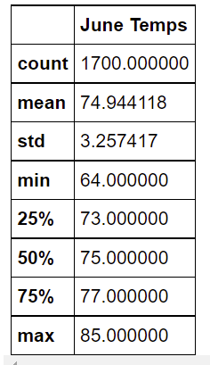
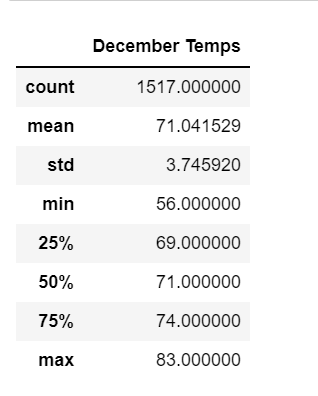

# surfs_up

## Overview of Project

### Purpose
The purpose of this analysis is to:
1. Find if Oahu is the good location to open the surf shop or not. 
2. To determine above analysis helps to determine the weather condition in Oahu. 

## Results

### Results of the analysis for months of June and December
1. Weather in June
	- Number of data points for June for which data was collected are 1700.
	- The average temperature for all days in June is around 75F which means the weather is pleasant. Not too cold or hot.
	- The 50% percentile is also around 75F which means the temperature is equally distributed for all the days in June.
	

2. Weather in December
	- Number of data points for December for which data was collected are 1617.
	- Average temperaturefor all days in December is around 71F which also means weather is quite pleasant. 
	- Even for December just as June, the 50% of data had around 71F so that says data is equally distributed.
	

## Summary 

1. In both the months June and December, the temperature is almost the same. Although the maximum temperature in June is little more
   than December, the mean is almost the same. 
2. This can be used to weigh our decision to open the Surf shop or not. 

- Additional Query:
1.We could use a where clause to find the exact temperature details for any particular station we are interested in. 
2.We could use count function to count number of days the temperature was above or below any specified limit. 
